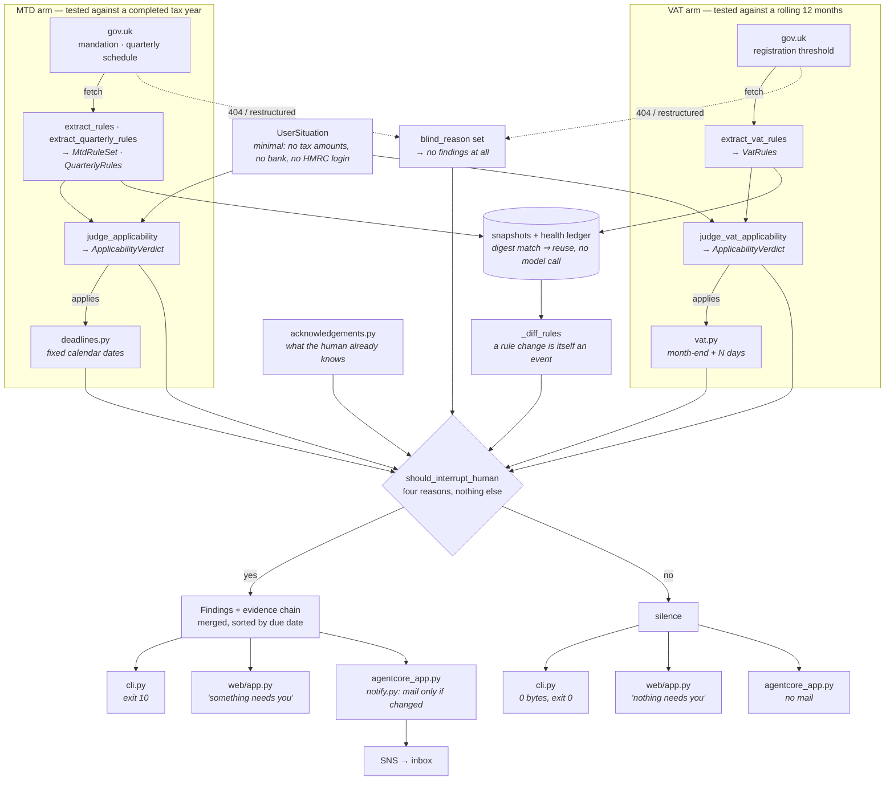

# Due Diligence

**A background agent that works out which UK tax obligations actually apply to a
self-employed person — across two schemes running on two different clocks —
traces every conclusion back to gov.uk, and stays silent unless there is
genuinely something for a human to decide.**

Built with the [Strands Agents SDK](https://github.com/strands-agents) for the
Agents for Humans hackathon — **Professional Agents** track.

**▶ Live demo: <https://e5jlgf9at6.execute-api.us-east-1.amazonaws.com>**
(Amazon Bedrock, running on Lambda. First request after an idle spell takes
~15s while the container starts and the gov.uk pages are read; after that ~5s.)

> **Not tax advice.** This agent reports which obligations appear to apply and
> when they fall due, with a source for every claim. It does not calculate tax
> owed and does not do tax planning.

---

## The problem

Making Tax Digital for Income Tax became mandatory on **6 April 2026**, and it
pulls people in over three years as the threshold drops:

| Wave | Qualifying income above | Mandatory from |
|---|---|---|
| 1 | £50,000 | **6 April 2026 — already live** |
| 2 | £30,000 | 6 April 2027 |
| 3 | £20,000 | 6 April 2028 |

Two things make this hard for the people it lands on:

**Nobody has muscle memory for it yet.** The first quarterly deadline in the
history of the scheme was 7 August 2026. This is not a rule people have been
following for twenty years — it is brand new, and it changes every year.

**Working out whether you are in scope is a judgement, not a lookup.** The rules
contain at least five traps that a reminder app cannot handle:

| Trap | Why people get it wrong |
|---|---|
| "Qualifying income" is turnover **before** expenses | People compute it from profit and conclude they are under the threshold |
| The threshold is tested on the **previous** year's filed return | Not the current year's income |
| Quarterly updates are **cumulative** from the start of the tax year | Intuition says each quarter stands alone |
| Two quarterly conventions — standard (6 Apr) vs calendar (1 Apr) | Pick the wrong one and every period is misaligned |
| **2026–27 is a grace year**: late quarterly updates carry no penalty points | It teaches a habit that starts costing money the following year |

And the threshold falling from £50k to £20k means each successive wave is
smaller, more marginal, and **less likely to have an accountant**.

### It is not one clock, it is several

The same person is simultaneously subject to VAT registration, which runs on a
completely different timebase — and mixing the two up is the single easiest way
to miss a deadline:

| | Making Tax Digital | VAT registration |
|---|---|---|
| Measured over | A **completed tax year** | A **rolling 12 months** |
| Which figure | Turnover on the prior year's filed return | Taxable turnover as at today |
| When it can trigger | Only at a tax-year boundary | **Any month** |
| Deadline | Fixed calendar dates (7 Aug, 7 Nov …) | 30 days from the **end of the month you crossed in** |
| Also triggered by | — | Merely **expecting** to cross within 30 days |

Someone under £50,000 for MTD can still be over £90,000 for VAT, and someone who
crossed the VAT threshold in June has a July deadline they will not find on any
annual calendar. Working out which of these apply, on which clock, is the
judgement this agent exists to make.

---

## What the agent does

Three mechanisms, none of which are specific to tax:

### 1. Verify before believing

Every conclusion carries the gov.uk page it came from and the date it was
checked. No figure is hardcoded — thresholds, dates and penalties are extracted
from the live page on every run. If the rules change, this agent finds out; a
version with the numbers baked in never would.

### 2. Know when it has gone blind

A fetch failure is an **event**, not a no-op. If the source 404s, or still loads
but no longer contains the text being looked for, the agent produces **no
finding at all** and reports that it cannot see. Silence is never allowed to be
mistaken for "nothing has changed".

### 3. Say nothing unless a human is needed

Exactly four things justify interrupting someone:

1. An obligation **newly** started applying to them
2. A deadline entered the danger window and has not been acknowledged
3. The rules changed in a way that affects them
4. The agent could not verify its own sources

The word *newly* in the first one is load-bearing. "MTD applies to you" is news
exactly once; announcing it again on every run is how a notification becomes
wallpaper, and it is the behaviour this product exists to replace. So verdicts
are acknowledged like deadlines are, and a standing duty goes quiet.

What acknowledgement can never silence: blindness, a rule change, or an
obligation that could not be dated. Those speak every time, by design —
`tests/test_silence.py` fails if that ever stops being true.

### Three-state verdicts

`applies` / `does_not_apply` / **`insufficient_info`**

The third is a correct answer, not a failure. Asked to judge someone who does
not know their prior-year turnover, the agent names the missing fact and
refuses. It never assumes an unknown figure is small.

---

## Using it

```bash
python -m src.cli check
```

That is the whole product. The first run asks a short set of questions and
stores the answers; every run after that does the work and **says nothing at
all** unless something genuinely needs you — not a heartbeat, not an "all
clear", no output and exit code 0. An unattended runner reads the exit code:

| Exit | Meaning |
|---|---|
| `0` | Nothing needs you |
| `10` | Something needs you |
| `1` | The agent could not run |

When it does speak, it shows only what is new, then why it broke silence:

```
🔴 VAT registration — APPLIES
   why: rolling 12-month taxable turnover is £96,000, which exceeds the
        £90,000 registration threshold, crossed in June 2026.
   source: https://www.gov.uk/vat-registration/when-to-register (checked 2026-08-16)

⛔ 2026-07-30 (17 days ago)  VAT registration — turnover passed £90,000
     if missed: registration takes effect 2026-08-01 regardless of when you
                register, so VAT is owed on sales from that date onward
                whether or not you charged it

  Why you are seeing this:
    → obligation applies to you: VAT registration
    → VAT registration — turnover passed £90,000 was due 17 days ago
```

```bash
python -m src.cli ack
```

Acknowledging is what ends a notification — never a timer. An unfiled statutory
return must not quietly disappear because a week went by, and it must not nag
forever either, so a human saying "I've seen it" is the only exit. Acknowledging
a verdict and acknowledging a deadline are separate: knowing MTD applies to you
says nothing about knowing that a particular quarter is overdue.

Once everything outstanding is acknowledged, `check` goes back to printing
nothing. That is the intended steady state.

```bash
python -m src.cli check --report   # show everything, including what is settled
python -m src.cli profile          # what it currently believes about you
python -m src.cli profile --reset  # forget it and ask again
```

## Running the web front end

```bash
python -m uvicorn web.app:app --reload
```

The same agent, same `src/`, rendered as a page. The browser version is
stateless — no stored profile, no acknowledgement ledger — because those are
per-person and a shared demo must not let one visitor's "I've seen it" silence
an obligation for everyone. The silence contract still shows, as the calm
*nothing needs you* result.

Deployment is two scripts:

```bash
bash scripts/build_lambda.sh && bash scripts/deploy_lambda.sh
```

`build_lambda.sh` carries a comment explaining why the package cannot be built
with a plain `pip install -t`: `strands-agents` depends on `mcp`, which requires
`pywin32` under `sys_platform == "win32"`, and pip evaluates that marker against
the build machine rather than `--platform`. The script resolves the dependency
graph itself with the target's markers, then installs it with `--no-deps`.

## Behaviour demos

Three scripts that exercise specific behaviours with fixed inputs, for anyone
who wants to see them without going through onboarding.

```bash
python run_applicability.py
```

Four people, both obligations judged for each:

| Person | MTD | VAT | Does it speak? |
|---|---|---|---|
| £62,000 prior year, £71,000 rolling | 🔴 `applies` | ⚪ `does_not_apply` | Yes — flags the 7 Aug deadline already missed |
| Property income, **turnover unknown** | 🟡 `insufficient_info` | 🟡 `insufficient_info` | Yes — names exactly which facts it needs |
| £14,000, under everything | ⚪ `does_not_apply` | ⚪ `does_not_apply` | **No — stays silent** |
| £68,000 prior year, **crossed £90,000 in June** | 🔴 `applies` | 🔴 `applies` | Yes — two duties, two deadlines, two different clocks |

```bash
python run_deadlines.py
```

Turns an `applies` verdict into the four dated filings for the year, each with
the real consequence of missing it — including the fact that 2026–27 is a grace
year and the same miss costs a penalty point from the next year onward.

```bash
python run_failure_modes.py
```

The three ways this is supposed to fail safely:

- **A** — the rules moved since the last run: the agent diffs against its
  snapshot and speaks up even though the user did nothing
- **B** — the source 404s: no finding is produced, and it says why
- **C** — the page still loads but was restructured: same, no finding

```bash
python -m pytest tests/ -q
```

47 tests over the date arithmetic of both obligations and the silence contract.
No model, no network. Two of them are there to fail loudly if the product's
central claims quietly stop being true:
`test_the_extracted_threshold_is_what_gets_reported` (someone hardcoded a
gov.uk figure) and `test_the_same_obligation_is_silent_once_acknowledged`
(the agent started nagging).

---

## Architecture



Three surfaces, one agent. The CLI has a human who can acknowledge; the web page
is stateless because it is shared; the scheduled arm has nobody in the loop, so
it substitutes change-detection for acknowledgement. All three call the same
`src.pipeline.run` and none of them contains a rule about tax.

The two arms are deliberately independent: a dead VAT page must not suppress an
MTD conclusion that was verified perfectly well, so each fetches, extracts,
judges and fails on its own. They meet only at the gate.

The layering is deliberate: **everything that can be pure logic is pure logic.**
The model is used only where judgement is genuinely required — reading prose off
a page, and deciding whether a rule lands on a person. Date arithmetic, snapshot
diffing and the interrupt decision are ordinary code, and are unit-tested
without a model or a network.

### Module map

| File | Responsibility |
|---|---|
| `src/models.py` | Domain types. All `frozen=True` — a run produces new objects, never mutates |
| `src/sources.py` | Primary-source fetch, snapshots, health ledger. Failure is recorded, not swallowed |
| `src/excerpt.py` | Anchor-based excerpting — sends the relevant passage, not a fixed head window |
| `src/agents.py` | The three Strands agents. The only file that knows which model provider is in use |
| `src/deadlines.py` | MTD verdict → dated obligations. Pure calendar arithmetic over extracted figures |
| `src/vat.py` | VAT verdict → registration deadline. Month-relative arithmetic, survives year boundaries and short Februaries |
| `src/acknowledgements.py` | What the human has already seen, so a missed deadline neither vanishes nor nags forever |
| `src/pipeline.py` | `fetch → extract → diff → judge → schedule → decide whether to speak` |
| `src/cli.py` | The product surface. Enforces the silence contract and the exit codes |
| `src/onboarding.py` | The one conversation. "I don't know" is a first-class answer here |
| `src/profile.py` | The answers, between runs. An agent re-briefed every time is just a script |
| `src/console.py` | UTF-8 stdout, so the report renders on any terminal |

---

## How Strands is used

| Need | Strands feature |
|---|---|
| Rules extracted as validated objects, not prose to parse | `Agent(structured_output_model=...)` with Pydantic schemas |
| Judgement returned in a shape the code can act on | Same, over a three-state `Verdict` enum |
| Provider independence | `strands.models.Model` as the type everywhere; `BedrockModel` chosen in exactly one function |
| Deterministic extraction | `temperature=0.0` — sampling variance in a rule extractor is a defect |

Amazon Bedrock, `us.anthropic.claude-haiku-4-5`, in `us-east-1`.

### Not calling the model when the answer cannot have changed

A page whose bytes are unchanged cannot have produced different rules, so
`src/extraction_cache.py` reuses the stored extraction and skips the model. It
takes a run from ~15s to ~5s, but the reason it exists is correctness: a model
asked the same question twice can answer it differently, and rules that drifted
while their source sat still would be indistinguishable from a real rule change
— the one signal this product must never cry wolf on.

The fetch, the digest comparison and the health ledger all still happen every
run. Only the model call is skipped. The agent never stops looking.

## Running unattended

The CLI and the web page both run because a person asked. The thing the product
description actually promises is the third arm: it wakes up on its own.

```
EventBridge Scheduler  ──daily──▶  AgentCore Runtime  ──▶  SNS ──▶  your inbox
   (carries the situation)          (agentcore_app.py)      (only on change)
```

The Strands SDK has no scheduling primitive, so the wake-up comes from
EventBridge Scheduler, whose universal target invokes the agent directly. The
schedule carries the person's situation in its payload, which keeps the runtime
itself stateless — watching a second person is a second schedule, not a code
change.

**The part that needed thought is when it is allowed to mail you.** On the
command line, acknowledging is what ends a notification. Nobody is in the loop
here, so the same rule would produce an identical email every morning until the
deadline passed — the nagging this product replaces, relocated to your inbox.

So the scheduled arm notifies on *change*: `src/notify.py` fingerprints the set
of reasons the agent wants a human, keeps the last one in S3, and sends only
when that set differs. Verified against the deployed runtime:

| Run | Needs a human? | Emails you? | |
|---|---|---|---|
| 1 | yes | **yes** | first time you are told |
| 2 | yes | no | nothing changed |
| 3 | yes | no | still nothing changed |
| 4 | no | no | it cleared — and it does not write to say so |

An agent that mails you to report that it has nothing to report has missed the
point.

```bash
bash scripts/build_agentcore.sh
bash scripts/deploy_agentcore.sh you@example.com
```

`build_agentcore.sh` targets **ARM64**, which the Lambda build does not. An
x86_64 artifact is accepted by the API and then fails asynchronously several
minutes later with a message about incompatible binaries, so the script checks
for stray x86_64 objects before it packages anything.

---

## Running it

Requires Python 3.10+ and AWS credentials with `bedrock:InvokeModel` for the
model above.

```bash
python -m venv .venv
```

```bash
.venv/Scripts/activate
```

```bash
pip install -r requirements.txt
```

```bash
python -m src.cli check
```

On macOS or Linux, activate with `source .venv/bin/activate` instead.

Override the defaults with environment variables if needed:

| Variable | Default |
|---|---|
| `AFH_MODEL_ID` | `us.anthropic.claude-haiku-4-5-20251001-v1:0` |
| `AWS_REGION` | `us-east-1` |

No state needs to be seeded — `data/` is created on first run.

---

## Scope

**In:** sole traders, optionally with property income · Making Tax Digital for
Income Tax and its quarterly schedule · VAT registration · gov.uk as the single
primary source · applicability, dates and consequences.

**Out:** calculating tax owed · tax planning · Self Assessment (its deadlines are
fixed calendar dates that need no judgement) · VAT deregistration · limited
companies and Corporation Tax · HMRC API integration · bank connections ·
countries other than the UK.

---

## Licence

MIT — see [LICENSE](LICENSE).
