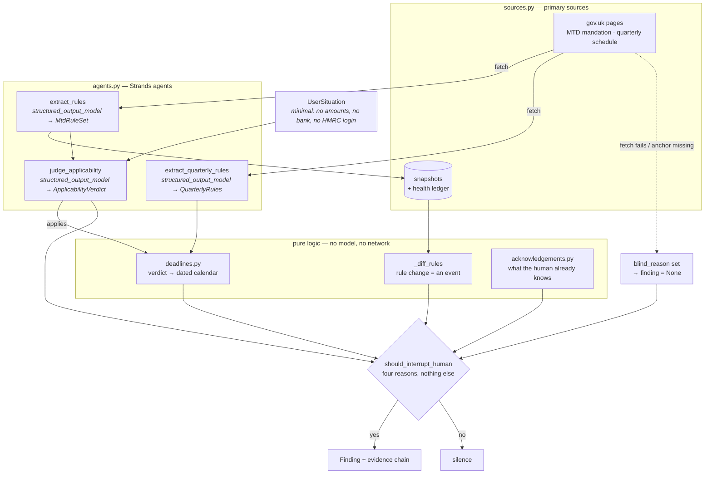

# Due Diligence

**A background agent that works out which UK tax obligations actually apply to a
self-employed person, traces every conclusion back to gov.uk, and stays silent
unless there is genuinely something for a human to decide.**

Built with the [Strands Agents SDK](https://github.com/strands-agents) for the
Agents for Humans hackathon — **Professional Agents** track.

> **Not tax advice.** This agent reports which obligations appear to apply and
> when they fall due, with a source for every claim. It does not calculate tax
> owed and does not do tax planning.

---

## The problem

Making Tax Digital for Income Tax became mandatory on **6 April 2026**, and it
pulls people in over three years as the threshold drops:

| Wave | Qualifying income above | Mandatory from |
|---|---|---|
| 1 | £50,000 | **6 April 2026 — already live** |
| 2 | £30,000 | 6 April 2027 |
| 3 | £20,000 | 6 April 2028 |

Two things make this hard for the people it lands on:

**Nobody has muscle memory for it yet.** The first quarterly deadline in the
history of the scheme was 7 August 2026. This is not a rule people have been
following for twenty years — it is brand new, and it changes every year.

**Working out whether you are in scope is a judgement, not a lookup.** The rules
contain at least five traps that a reminder app cannot handle:

| Trap | Why people get it wrong |
|---|---|
| "Qualifying income" is turnover **before** expenses | People compute it from profit and conclude they are under the threshold |
| The threshold is tested on the **previous** year's filed return | Not the current year's income |
| Quarterly updates are **cumulative** from the start of the tax year | Intuition says each quarter stands alone |
| Two quarterly conventions — standard (6 Apr) vs calendar (1 Apr) | Pick the wrong one and every period is misaligned |
| **2026–27 is a grace year**: late quarterly updates carry no penalty points | It teaches a habit that starts costing money the following year |

And the threshold falling from £50k to £20k means each successive wave is
smaller, more marginal, and **less likely to have an accountant**.

---

## What the agent does

Three mechanisms, none of which are specific to tax:

### 1. Verify before believing

Every conclusion carries the gov.uk page it came from and the date it was
checked. No figure is hardcoded — thresholds, dates and penalties are extracted
from the live page on every run. If the rules change, this agent finds out; a
version with the numbers baked in never would.

### 2. Know when it has gone blind

A fetch failure is an **event**, not a no-op. If the source 404s, or still loads
but no longer contains the text being looked for, the agent produces **no
finding at all** and reports that it cannot see. Silence is never allowed to be
mistaken for "nothing has changed".

### 3. Say nothing unless a human is needed

Exactly four things justify interrupting someone:

1. A new obligation started applying to them
2. A deadline entered the danger window and has not been acknowledged
3. The rules changed in a way that affects them
4. The agent could not verify its own sources

Everything else is silence. In the demo below, the third person — comfortably
under every threshold — produces no notification at all.

### Three-state verdicts

`applies` / `does_not_apply` / **`insufficient_info`**

The third is a correct answer, not a failure. Asked to judge someone who does
not know their prior-year turnover, the agent names the missing fact and
refuses. It never assumes an unknown figure is small.

---

## Demo

```bash
python run_applicability.py
```

Three people, one run each:

| Person | Verdict | Does it speak? |
|---|---|---|
| Sole trader, £62,000 turnover (2024–25) | 🔴 `applies` from 2026-04-06 | Yes — and flags the 7 Aug deadline already missed |
| Sole trader with property income, **turnover unknown** | 🟡 `insufficient_info` | Yes — names the one fact it needs |
| Sole trader, £14,000 turnover | ⚪ `does_not_apply` | **No — stays silent** |

```bash
python run_deadlines.py
```

Turns an `applies` verdict into the four dated filings for the year, each with
the real consequence of missing it — including the fact that 2026–27 is a grace
year and the same miss costs a penalty point from the next year onward.

```bash
python run_failure_modes.py
```

The three ways this is supposed to fail safely:

- **A** — the rules moved since the last run: the agent diffs against its
  snapshot and speaks up even though the user did nothing
- **B** — the source 404s: no finding is produced, and it says why
- **C** — the page still loads but was restructured: same, no finding

```bash
python -m pytest tests/ -q
```

19 tests over the date arithmetic. No model, no network.

---

## Architecture



The layering is deliberate: **everything that can be pure logic is pure logic.**
The model is used only where judgement is genuinely required — reading prose off
a page, and deciding whether a rule lands on a person. Date arithmetic, snapshot
diffing and the interrupt decision are ordinary code, and are unit-tested
without a model or a network.

### Module map

| File | Responsibility |
|---|---|
| `src/models.py` | Domain types. All `frozen=True` — a run produces new objects, never mutates |
| `src/sources.py` | Primary-source fetch, snapshots, health ledger. Failure is recorded, not swallowed |
| `src/excerpt.py` | Anchor-based excerpting — sends the relevant passage, not a fixed head window |
| `src/agents.py` | The three Strands agents. The only file that knows which model provider is in use |
| `src/deadlines.py` | Verdict → dated obligations. Pure calendar arithmetic over extracted figures |
| `src/acknowledgements.py` | What the human has already seen, so a missed deadline neither vanishes nor nags forever |
| `src/pipeline.py` | `fetch → extract → diff → judge → schedule → decide whether to speak` |
| `src/console.py` | UTF-8 stdout, so the report renders on any terminal |

---

## How Strands is used

| Need | Strands feature |
|---|---|
| Rules extracted as validated objects, not prose to parse | `Agent(structured_output_model=...)` with Pydantic schemas |
| Judgement returned in a shape the code can act on | Same, over a three-state `Verdict` enum |
| Provider independence | `strands.models.Model` as the type everywhere; `BedrockModel` chosen in exactly one function |
| Deterministic extraction | `temperature=0.0` — sampling variance in a rule extractor is a defect |

Amazon Bedrock, `us.anthropic.claude-haiku-4-5`, in `us-east-1`.

**Not yet done:** AgentCore deployment and a hosted live demo. The SDK provides
no scheduling primitive, so the recurring wake-up this product implies needs
AgentCore Runtime or EventBridge. Today the agent runs on demand from the CLI.

---

## Running it

Requires Python 3.10+ and AWS credentials with `bedrock:InvokeModel` for the
model above.

```bash
python -m venv .venv
```

```bash
.venv/Scripts/activate
```

```bash
pip install -r requirements.txt
```

```bash
python run_applicability.py
```

On macOS or Linux, activate with `source .venv/bin/activate` instead.

Override the defaults with environment variables if needed:

| Variable | Default |
|---|---|
| `AFH_MODEL_ID` | `us.anthropic.claude-haiku-4-5-20251001-v1:0` |
| `AWS_REGION` | `us-east-1` |

No state needs to be seeded — `data/` is created on first run.

---

## Scope

**In:** sole traders, optionally with property income · Making Tax Digital for
Income Tax and its quarterly schedule · gov.uk as the single primary source ·
applicability, dates and consequences.

**Out:** calculating tax owed · tax planning · limited companies and Corporation
Tax · HMRC API integration · bank connections · countries other than the UK.

---

## Licence

MIT — see [LICENSE](LICENSE).
